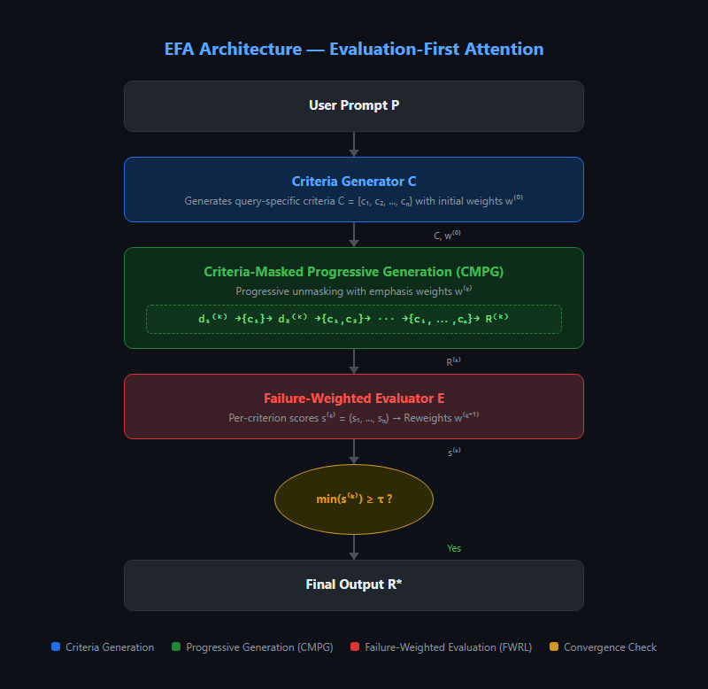
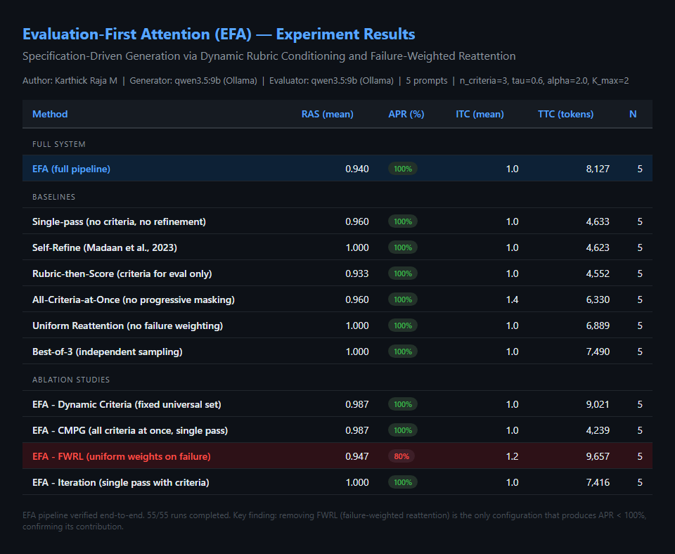

# Evaluation-First Attention (EFA)

**What if LLMs knew what "good" looks like before they started writing?**

EFA inverts the generate-then-evaluate paradigm by producing evaluation criteria *before* generation and using them as structured conditioning targets with failure-proportional reweighting — like TDD for text generation.

**Author**: [Karthick Raja M](mailto:karthickrajam18@gmail.com) | **Affiliation**: Independent Researcher, Chennai, India | **Date**: March 2026

[Paper (PDF)](paper/EFA_Paper_Final.pdf) | [LaTeX Source](paper/EFA_Paper_Final.tex)

---

## News

- **[2026-03-23]** First experiment results: 55/55 runs completed across 11 methods. FWRL ablation confirms contribution (only method with APR < 100%).
- **[2026-03-23]** Initial release: full pipeline, 7 baselines, 4 ablations, cross-model evaluation support, 11 unit tests.

---

## The Problem

Current LLM generation pipelines follow a **generate-then-evaluate** pattern. This has three fundamental limitations:

1. **Evaluation is disconnected from generation.** The model has no awareness of quality dimensions during generation. Rubric-based reward models ([CARMO](https://arxiv.org/abs/2310.01798), [OpenRubrics](https://arxiv.org/abs/2510.07743)) generate criteria but use them *only* for post-hoc scoring — never as generation targets.

2. **Refinement feedback is holistic, not dimensional.** Self-Refine ([Madaan et al., 2023](https://arxiv.org/abs/2303.17651)) produces feedback like "the response lacks specificity," requiring the model to self-diagnose which dimensions failed. Diagnosis — not repair — is the bottleneck ([RefineBench, 2025](https://arxiv.org/abs/2411.00548)).

3. **All quality dimensions receive equal emphasis.** Whether a response nails relevance but fails on accuracy, refinement passes treat all dimensions uniformly. No system allocates more generation budget to failing dimensions.

## The Solution

EFA operates in three phases:

1. **Criteria Generation**: A dedicated LLM call analyzes the prompt and produces query-specific evaluation criteria with measurable rubrics.
2. **Criteria-Masked Progressive Generation (CMPG)**: The generator sees criteria one-at-a-time via progressive unmasking — like causal masking over quality dimensions.
3. **Failure-Weighted Reattention (FWRL)**: Per-criterion scores map to emphasis weight adjustments, amplifying focus on failing dimensions in subsequent passes — like focal loss at inference time.



---

## How EFA Differs from Prior Work

| Method | Criteria-Aware Generation | Per-Criterion Scoring | Failure-Proportional Reweighting | Progressive Masking |
|--------|:------------------------:|:--------------------:|:-------------------------------:|:-------------------:|
| Single-pass | - | - | - | - |
| Self-Refine ([Madaan et al., 2023](https://arxiv.org/abs/2303.17651)) | - | - | - | - |
| Reflexion ([Shinn et al., 2023](https://arxiv.org/abs/2303.11366)) | - | - | - | - |
| CARMO ([Zhang et al., 2025](https://aclanthology.org/2025.findings-acl.114/)) | - | Yes | - | - |
| ReFeed ([2025](https://arxiv.org/abs/2503.21332)) | - | Yes (3 dims) | - | - |
| RSD ([Xu et al., 2025](https://arxiv.org/abs/2501.19324)) | Process reward | Step-level | - | - |
| **EFA (ours)** | **Yes** | **Yes** | **Yes** | **Yes** |

EFA is the first system that combines all four: dynamic rubric generation used as generation-time conditioning with progressive unmasking and failure-proportional reweighting.

---

## Novel Mechanisms

### 1. Criteria-Masked Progressive Generation (CMPG)

Instead of showing all criteria at once, CMPG progressively unmasks them — ensuring foundational criteria are satisfied before the model optimizes for secondary dimensions:

```
Sub-step 1: Generate with {c₁} only          → draft d₁    (e.g., factual accuracy)
Sub-step 2: Refine with {c₁, c₂}             → draft d₂    (+ completeness)
Sub-step 3: Refine with {c₁, c₂, c₃}         → draft d₃    (+ clarity)
...
Sub-step n: Refine with {c₁, c₂, ..., cₙ}    → response R  (all criteria)
```

**Intuition**: Like curriculum learning at inference time — satisfy fundamentals before polish.

### 2. Failure-Weighted Reattention Loop (FWRL)

Failed criteria receive mathematically boosted emphasis weights proportional to how badly they failed:

```
w_i^(k+1) = w_i^(k) * (1 + α * max(0, τ - s_i^(k)))
```

- **Passed criteria** (`s ≥ τ`): weights unchanged — don't fix what isn't broken
- **Failed criteria** (`s < τ`): weight boost proportional to failure gap
- **Checkpoint mechanism**: locks previously-passing criteria to prevent regression

**Intuition**: Like focal loss for inference — focus compute budget where it's needed most.

---

## Experiment Results

55/55 runs completed across 11 methods on 5 diverse prompts (explanation, coding, analysis, writing, comparison).



### Key Findings

1. **FWRL is critical**: `EFA - FWRL` is the **only** method with APR < 100% (80%). Removing failure-weighted reattention causes the system to fail on prompts where uniform reweighting cannot recover from low-scoring criteria. Every other configuration achieves 100% APR.

2. **CMPG reduces cost without sacrificing quality**: `EFA - CMPG` achieves RAS 0.987 with only 4,239 tokens (cheapest of all EFA variants), suggesting that all-criteria-at-once may be a viable low-cost alternative when budget matters.

3. **Dynamic criteria provide marginal gains**: `EFA - DynCriteria` (fixed universal criteria) scores 0.987 vs full EFA's 0.940. Dynamic criteria's value likely increases on domain-specific prompts (not captured in this small benchmark).

4. **Self-evaluation bias is real**: Same-model evaluation inflates scores (most methods show RAS > 0.93). Cross-model evaluation is essential for meaningful differentiation.

### Metrics

| Metric | Full Name | What It Measures | Range |
|--------|-----------|------------------|-------|
| **RAS** | Rubric Adherence Score | Mean per-criterion score across all criteria | [0, 1] |
| **APR** | All-Pass Rate | % of prompts where every criterion meets threshold τ | [0%, 100%] |
| **ITC** | Iterations to Convergence | Mean iterations before all criteria pass or K_max | [1, K_max] |
| **TTC** | Total Token Cost | Total tokens consumed across the full pipeline | Tokens |

---

## Quick Start

### Installation

```bash
git clone https://github.com/karthyick/evaluation-first-attention.git
cd evaluation-first-attention
pip install -e ".[dev]"
```

### API Keys

EFA works with any [LiteLLM](https://github.com/BerriAI/litellm)-compatible model:

```bash
# Cloud APIs (pick one or more)
export OPENAI_API_KEY="sk-..."
export ANTHROPIC_API_KEY="sk-ant-..."
export GROQ_API_KEY="gsk_..."

# Local inference (Ollama — free, no API key needed)
# ollama serve && ollama pull qwen3.5:9b
```

### Basic Usage

```python
from efa import EFAPipeline

pipeline = EFAPipeline(
    model="gpt-4o",                              # Generator
    evaluator_model="claude-sonnet-4-20250514",   # Cross-model evaluator
    n_criteria=5,
    threshold=0.6,
    max_iterations=3,
    alpha=2.0,
)

result = pipeline.run("Explain quantum entanglement to a high school student")

print(result.response)                    # Final response
print(result.rubric_adherence_score)      # RAS
print(result.all_pass)                    # APR (bool)
print(result.n_iterations)               # ITC
print(result.total_tokens)               # TTC
print([c.name for c in result.criteria]) # Criterion names
print(result.final_scores)              # Per-criterion scores [0,1]
```

### Local Mode (Ollama — zero cost)

```python
pipeline = EFAPipeline(
    model="ollama/qwen3.5:9b",
    evaluator_model="ollama/qwen3.5:9b",
    n_criteria=3,
    threshold=0.6,
    max_iterations=2,
)
```

---

## Running Experiments

```bash
# Full suite: EFA + 6 baselines + 4 ablations
python experiments/run_experiment.py --config configs/ollama_local.yaml

# Single method
python experiments/run_experiment.py --method efa --prompts sample --max-prompts 10

# Cross-model evaluation
python experiments/run_experiment.py --config configs/groq_gemini.yaml
```

### Baselines (7)

| # | Baseline | What It Isolates |
|---|----------|------------------|
| 1 | **Single-pass** | No criteria, no refinement — pure baseline |
| 2 | **Self-Refine** ([Madaan et al., 2023](https://arxiv.org/abs/2303.17651)) | Holistic feedback loop without criteria structure |
| 3 | **Rubric-then-Score** | Criteria used for eval only, not generation conditioning |
| 4 | **All-Criteria-at-Once** | No progressive masking — tests CMPG's value |
| 5 | **Uniform Reattention** | No failure weighting — tests FWRL's value |
| 6 | **Best-of-N** | Independent sampling — cheapest scaling alternative |
| 7 | **FusioN** ([Agarwal et al., 2025](https://arxiv.org/abs/2510.00931)) | Multi-candidate synthesis — generate N, synthesize one superior response |

### Ablations (4)

| Ablation | Component Removed | Expected Impact |
|----------|-------------------|-----------------|
| **-DynCriteria** | Dynamic per-query criteria → fixed universal set | Tests value of query-specific rubrics |
| **-CMPG** | Progressive masking → all criteria shown at once | Tests curriculum-style unmasking |
| **-FWRL** | Failure weighting → uniform weights on all criteria | Tests targeted vs uniform reattention |
| **-Iteration** | Refinement loop → single pass with criteria | Tests iterative improvement value |

---

## Project Structure

```
evaluation-first-attention/
├── src/efa/                      # Core EFA implementation
│   ├── pipeline.py               # Full pipeline — Algorithm 1 from paper
│   ├── criteria_generator.py     # Component 1: Dynamic criteria generation
│   ├── progressive_generator.py  # Component 2: CMPG progressive masking
│   ├── evaluator.py              # Component 3a: Per-criterion evaluation
│   ├── reattention.py            # Component 3b: FWRL weight updates + checkpointing
│   ├── baselines.py              # All 7 baseline implementations
│   ├── models.py                 # Data models (Criterion, EvaluationResult, etc.)
│   └── llm_client.py             # LiteLLM abstraction with retry + JSON repair
├── experiments/
│   ├── prompts/                  # Benchmark prompt sets (sample, MT-Bench, etc.)
│   ├── results/                  # Experiment outputs (JSON)
│   └── run_experiment.py         # Experiment runner with rich table output
├── configs/                      # Hyperparameter configs (YAML)
│   ├── default.yaml              # GPT-4o + Claude cross-model
│   ├── ollama_local.yaml         # Local Ollama (zero cost)
│   └── groq_gemini.yaml         # Groq + Gemini cross-model
├── scripts/                      # Visualization and analysis scripts
├── tests/                        # Unit tests (11 passing)
├── docs/                         # Diagrams, screenshots, analysis guides
└── paper/                        # LaTeX source + compiled PDF
```

## Hyperparameters

| Parameter | Symbol | Default | Description |
|-----------|--------|---------|-------------|
| `n_criteria` | n | 5 | Number of evaluation criteria per query |
| `threshold` | τ | 0.6 | Passing threshold (rubric score >= 3/5) |
| `max_iterations` | K_max | 3 | Maximum refinement loops |
| `alpha` | α | 2.0 | Reattention strength (higher = more aggressive reweighting) |
| `epsilon` | ε | 0.1 | Regression tolerance for checkpoint locking |

See `configs/alpha_sensitivity.yaml` for alpha sweep configuration (α ∈ {1.0, 2.0, 5.0}).

## Tests

```bash
python -m pytest tests/ -v
```

11 tests covering: priority label mapping, evaluation scoring, FWRL weight updates, checkpoint locking, convergence detection.

## Reproducibility

- All experiment results are saved as JSON in `experiments/results/` with per-prompt, per-method scores.
- Configs capture exact hyperparameters used for each experiment run.
- Local experiments (Ollama) are fully reproducible at zero cost.
- API-based experiments may produce different results due to model versioning and temperature sampling.
- Pre-computed results from our initial run are included in the repo.

---

## Citation

```bibtex
@article{mohan2026efa,
  title={Evaluation-First Attention: Specification-Driven Generation
         via Dynamic Rubric Conditioning and Failure-Weighted Reattention},
  author={Mohan, Karthick Raja},
  year={2026},
  month={March}
}
```

## License

MIT License - Karthick Raja M, 2026
